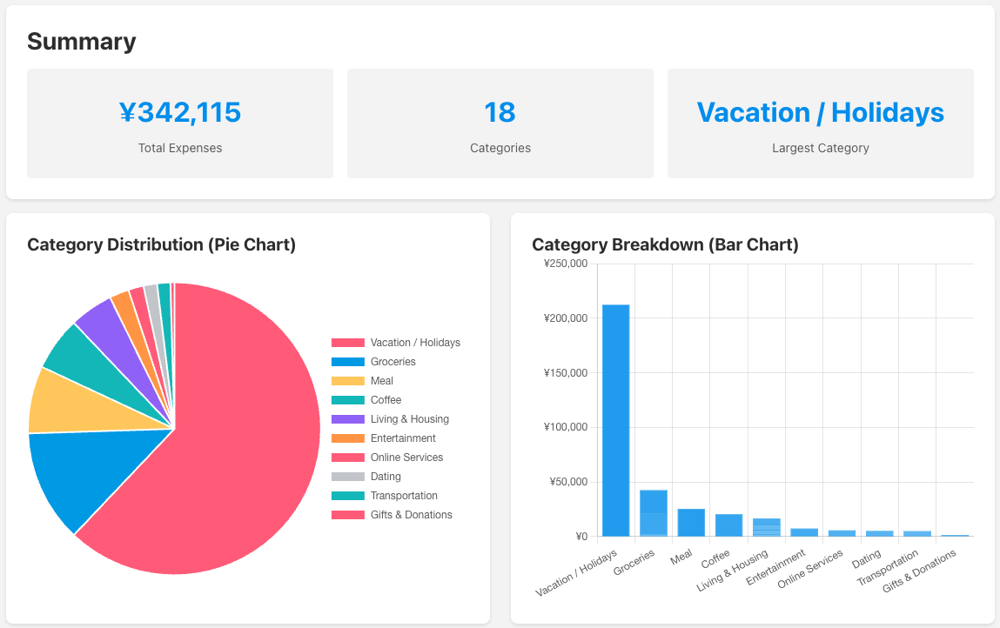
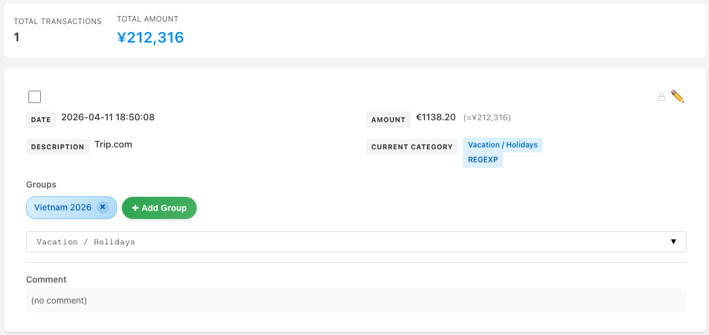
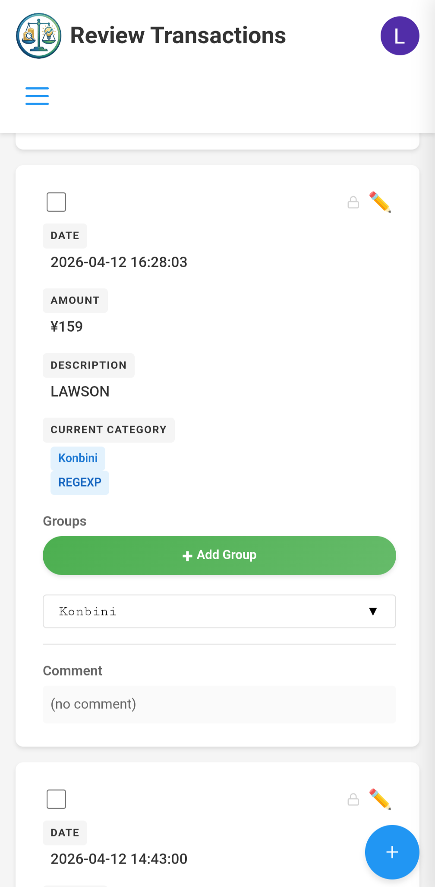

# SpendSense

[](https://spendsense.dev)
[](https://codecov.io/gh/lruggieri/spendsense)
[](https://www.python.org/)
[](https://docs.docker.com/get-docker/)
[](https://polyformproject.org/licenses/noncommercial/1.0.0)

**Self-hosted expense tracker with ML-powered auto-categorization.**

Import transactions from bank notification emails, and SpendSense categorizes them automatically using a three-tier system that gets smarter over time. Your financial data stays on your server — no cloud dependency, no third-party access.

**[Getting Started](#getting-started)** | **[Privacy Architecture](#privacy-architecture)**

<p align="center">
  
  
  
</p>

## Why SpendSense?

- **No bank connections needed** — imports transactions from bank notification emails, no screen-scraping or API tokens to configure
- **Auto-categorizes** — a three-tier ML system (manual rules > regex patterns > semantic similarity) that improves as you use it, so you spend less time sorting transactions
- **Self-hosted** — your data lives on your server, encrypted at rest, under your control
- **Free for personal use** — no subscription, no ads, no data harvesting

## Features

### Auto-Categorization

SpendSense classifies every transaction through three tiers, checked in order:

1. **Manual assignments** — explicit user mappings that always win
2. **Regex patterns** — visual pattern builder, no regex knowledge needed
3. **ML similarity** — sentence-transformers (`all-MiniLM-L6-v2`) matches new transactions against previously categorized ones

As you correct and confirm categories, the system learns. After initial setup, most transactions categorize themselves.

### Gmail Import

- Configurable **Fetchers** extract transaction data (amount, merchant, currency) from notification emails
- LLM-powered fetcher generation (Gemini) — point it at a sample email and it writes the extraction pattern
- All Gmail access happens **client-side in the browser** — your email token never touches the server (see [Privacy](#privacy-architecture))

### Encryption and Auth

- **Passkey-based authentication** — no passwords
- **AES-256-GCM** field-level encryption with envelope encryption
- Data encryption key wrapped with a key derived from your WebAuthn passkey (PRF extension)

### Analytics and Organization

- Spending charts by category, trend lines, date range filtering
- Multi-currency support with automatic ECB exchange-rate conversion
- Hierarchical category tree — filter by parent to include all subcategories
- **Groups** — tag transactions into custom groups (e.g. "Vacation 2025") with per-group breakdowns

### Progressive Web App

- Installable on mobile and desktop, offline caching via service worker
- Mobile-first responsive design
- Guided onboarding wizard

## Privacy Architecture

SpendSense is designed so your email data never reaches the server:

| Layer | How it works |
|-------|-------------|
| **Gmail OAuth** | `gmail.readonly` scope via Google Identity Services, handled client-side |
| **Token storage** | OAuth token stays in `localStorage`, never sent to the server |
| **Email parsing** | Transaction extraction runs in JavaScript in the browser |
| **Encryption** | Opt-in AES-256-GCM encryption at rest using a passkey-derived key |

This architecture also avoids Google's CASA audit requirement for server-side sensitive scopes.

## Tech Stack

| Layer | Technology |
|-------|-----------|
| **Backend** | Python / Flask, SQLite, Gunicorn |
| **ML** | sentence-transformers (`all-MiniLM-L6-v2`), PyTorch |
| **Frontend** | Vanilla JavaScript, Chart.js, CSS (no framework) |
| **Auth** | WebAuthn / passkeys, Google OAuth |
| **Encryption** | AES-256-GCM, AES Key Wrap (RFC 3394), WebAuthn PRF |
| **Infra** | Docker, service worker (PWA) |

## Getting Started

**Prerequisites:** Docker (recommended) or Python 3.12+

### Docker (recommended)

```bash
cp .env.example .env   # fill in credentials
docker compose up --build
# → http://localhost:5678
```

### Local

```bash
cp .env.example .env   # fill in credentials
make install
make run
# → http://localhost:5000
```

### Environment Variables

| Variable | Required | Description |
|---|---|---|
| `GOOGLE_CLIENT_ID` | Yes | Google OAuth client ID |
| `GOOGLE_CLIENT_SECRET` | Yes | Google OAuth client secret |
| `FLASK_SECRET_KEY` | Yes | Session encryption key |
| `GEMINI_API_KEY` | No | Enables LLM-powered fetcher generation |
| `ALLOWED_EMAILS` | No | Comma-separated allowlist (open access if unset) |

See [`.env.example`](.env.example) for the full list. For OAuth setup instructions, see [`config/README.md`](config/README.md).

> **Note:** SpendSense currently imports from Gmail only. If your bank sends push notifications instead of emails, you can use [IFTTT](https://ifttt.com/) to forward them to email.

## Development

```bash
make test    # all tests (Python + JS)
make mypy    # type checking
make check   # tests + mypy + lint
make run     # dev server
```

Architecture follows Domain-Driven Design: `domain/` (entities) → `application/` (use cases) → `infrastructure/` (persistence) → `presentation/` (web UI).

## License

[PolyForm Noncommercial 1.0.0](https://polyformproject.org/licenses/noncommercial/1.0.0) — free for personal use. See [`LICENSE`](LICENSE).
